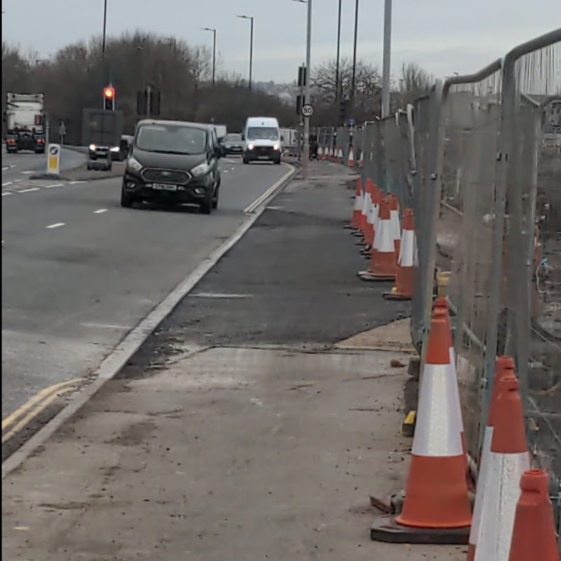
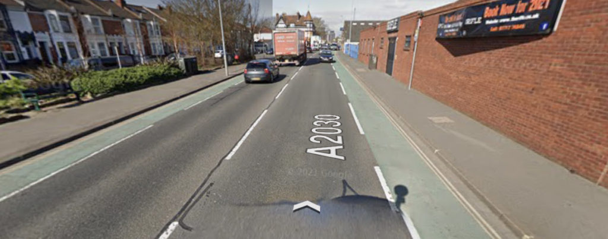
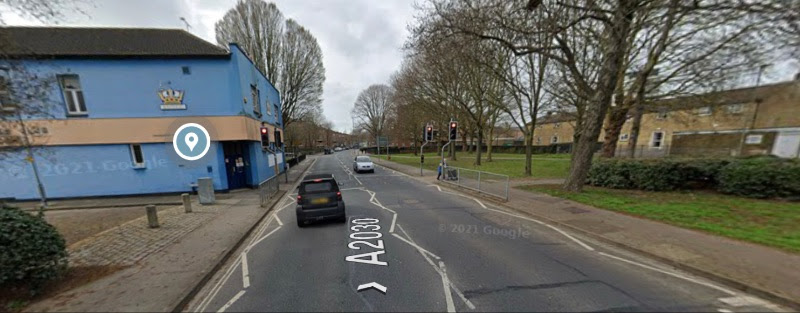

Twelve months ago it was announced that the Eastern Road path would be widened.  
12 months later work has now started and there are a number of other schemes being designed and presented for feedback from residents.

We have rounded them up here for you…

## Eastern Road Improvements

If you have not travelled along the Eastern road in the last six weeks, you may have missed the changes currently happening between Airport Service Road and Burrfields Road.  
  
This section is the first part of a three year plan to upgrade the current inadequate shared path and is finally being widened to better accommodate the increasing numbers of people walking and cycling along its length. It will be almost twice its current width, with three metres becoming a demarcated, dedicated two-way cycle track and the remainder being for pedestrians.  
  
The first phase extends from the entry to Langstone Harbour playing fields to the start of the land leased by the caravan park. The redundant old lay-by has now been filled in (image below), creating a more direct route and increasing visibility along the path.  
  
A further phase will replace the hedged section alongside the caravan park, and lampposts throughout the route will be relocated to the harbour side of the new path.  
  
Work here is being carried overnight and the road itself is closed to motor vehicles, although there should be a safe route along the northbound carriageway for people walking and cycling during working hours.  
  

* * *

## Sustainable Travel Schemes

The following schemes are currently out for survey.  They are being funded as part of the Transforming Cities funding award the council secured which is to aimed at improving bus travel, speed and reliability across the wider region to enable more people to switch away from bringing card into the city. As part of this, there are a some active travel improvements being made.  
  
The surveys are to gather feedback prior to further design work and a formal application to make the changes.  It is your opportunity to comment on the ideas as outlined and help to shape the next stage of development when actual design drawings will be produced.  
  
You can read more about all of the schemes under the TCF bid at the **[South East Hampshire Rapid Transit (SEHRT) website](https://www.sehrt.org.uk/schemes/).**

### Goldsmith Avenue - Closes 9th January

Goldsmith Avenue is identified in the Local Cycling and Walking Infrastructure Plan (LCWIP) as one of Portsmouth’s key cycle routes, and is a significant section of the east to west corridor. These proposals build on the current cycle scheme on Goldsmith Avenue, extending from Fratton Bridge to the city centre via Sydenham Terrace and Canal Walk.

[**To complete the survey follow this link**](https://www.sehrt.org.uk/schemes/goldsmith-avenue-cycling/)

### Fratton to City Centre Walking Route - Closes 9th January

Despite its name, this also includes cycling upgrades, notably around Sydenham terrace and the recently closed corner at Canal Walk. This scheme will link with the improved Goldsmith Avenue cycle route.  
  
With 24% of all journeys to work less than 1.2 miles, there is significant potential to increase the number of those who walk to work in the city. Improved footpaths with reduced crossing distances offer safer and more attractive walking routes, giving more priority to pedestrians. 

[**Complete the survey here**](https://www.sehrt.org.uk/schemes/fratton-bridge-walking/)

### Lake Road Closes 31st January

Lake Road is a busy east-west route from the city centre to the residential areas of Landport and Fratton. This route experiences congestion at peak times, especially in the morning. It is a key route for many bus services travelling in and out of the city, and forms part of a popular cycling route. Public transport infrastructure improvements will save time on journeys, and improvements to the roundabout will make it safer for people walking and cycling.

[**Complete the survey here**](https://www.sehrt.org.uk/schemes/lake-road/)

### City Centre North & South - Closes 31st January

These schemes propose the introduction of a new bus-only access roads so buses avoid getting caught in, and adding to, congestion in the city centre.

In the north this consists of using Charlotte street (closed to through traffic since Aug 20) and in the south, making changes to Isambard Brunel Road  / Commercial Road / Railway Station area.  

[**City Centre North survey here**](https://www.sehrt.org.uk/schemes/public-transport-infrastructure-city-centre-north/)

[**City Centre South Survey here**](https://www.sehrt.org.uk/schemes/public-transport-infrastructure-city-centre-south/)
